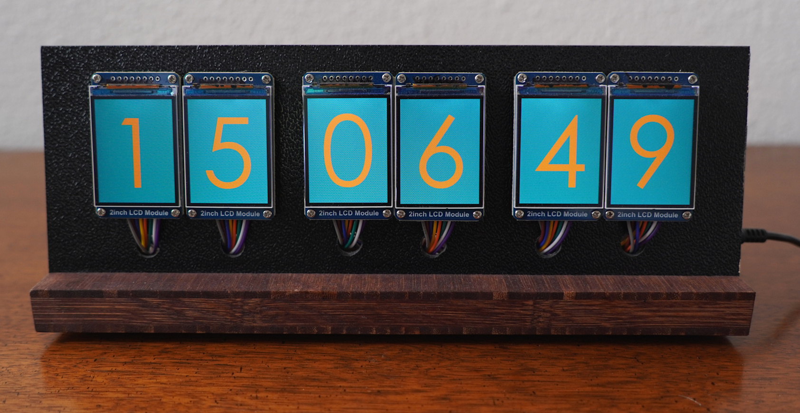

This Raspberry Pi (RPi) hosted psuedo-nixie clock uses 320x240 SPI LCD displays 
instead of actual nixie tubes.

The clock runs within a server running on the RPi.  The server supports multiple,
simultaneous, clients.

The following package needs to be installed on the RPi: PIL.

The following packages needs to be installed on the machine running the client: Kivy

Users control the clock by connecting to the server with either	the supplied a command
line client or the supplied GUI.

Connections require that the RPi is connected to wireless LAN.	Connections can be made
either directly over the LAN or over the inernet.

The GUI is implemented using the python Kivy package and, as such, can run on a PC, Mac, 
or Android phone.

Users can create their own styles (digit color, background color).  Style creation uses 
the PIL package.  Pictures (they need to be exactly 240x320 pixels in size) can also be
downloaded (uploaded?) to the RPi and the user can display them at will.

Some of the clock's code is common with another, second, project.  To prevent having to 
copy/paste changes/bug-fixes back and forth between projects, this common code resides 
in a third project. Copy the shared code into the root directory of this project.

The common code can be found here:
https://github.com/sgarrow/sharedClientServerCode

More information (including parts list, wiring diagrams, configuration and operation 
instructions) can be found in the docs folder.	Note that the links within the 
documentation don't seem to work when viewed within GitHub but they do work if the 
doc is downloaded to the local machine.

Note: I found the LCD/SPI driver supplied by the display amnufacturer (Waveshare) to
be overly large and hard to configure so I wrote a small driver that requires no configuration.
